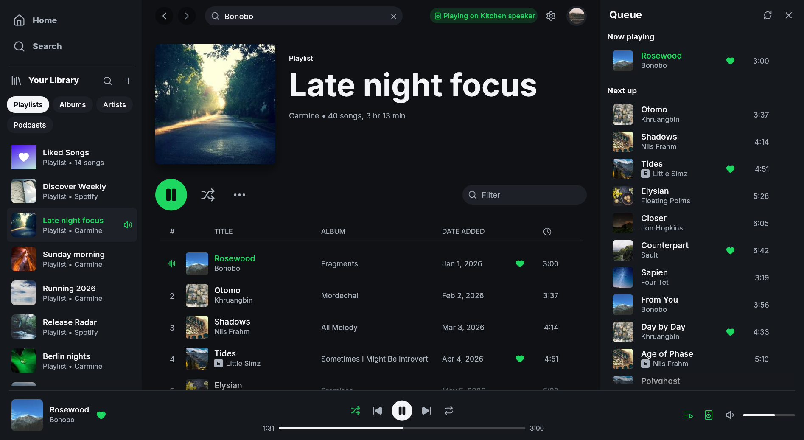
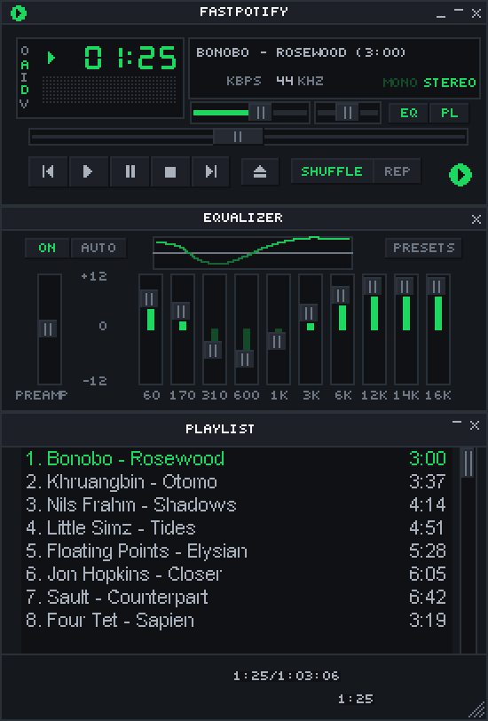

# Fastpotify

**Spotify, native and fast.** Fastpotify is a Spotify client written in
Rust with [egui](https://github.com/emilk/egui). It plays music through
[librespot](https://github.com/librespot-org/librespot). It typically uses
100–250 MB of RAM, while Spotify's desktop app often uses 600 MB to over 1 GB.
It runs on Linux, macOS, and Windows, starts in well under a second, and has no
browser engine.

**Playback needs Spotify Premium.** Free accounts can browse and search, but
cannot play music through Fastpotify on this computer or another device.



See [fastpotify.rocks](https://fastpotify.rocks/) for installation, setup,
everyday use, and connection details.

## What it does

- **Plays music on this computer.** Fastpotify appears as a Spotify Connect
  device. Select it from your phone or play music in the app. Playback is
  gapless and supports up to 320 kbps, with
  optional volume normalisation and an on-disk audio cache.
- **Controls other devices.** Move playback to a speaker, a phone, or
  another computer from the device picker, and keep controlling it: play,
  pause, skip, seek, shuffle, repeat, volume.
- **Finds speakers on your network.** Fastpotify finds librespot, spotifyd,
  and supported hardware receivers over mDNS. Once connected, they appear as
  Spotify Connect devices.
- **Library.** Browse playlists, Liked Songs, saved albums, followed artists,
  podcasts, and saved episodes. Filter, pin, and reorder sidebar items.
- **Search** across songs, artists, albums, playlists, podcasts, and episodes,
  with a top result and per-type views.
- **Home** with Made for you, Recently played, your top artists and songs, and
  recommendations.
- **Artist pages** with popular songs, a filterable discography, and related
  artists. **Album**, **playlist**, and **podcast** pages support playback
  from any row.
- **Edit your playlists.** Create, rename, describe, reorder, and delete them.
  Add songs from a row menu or drag them to a playlist in the sidebar.
- **Queue** as a side panel or a page; add anything to it from a row menu.
- **Resumes the last session.** On startup, the last song is paused where it
  stopped. Play resumes it, and the other playback controls work before it
  starts.
- **Album-art colour.** Pages and the player bar take a tint from the cover
  of what you are looking at or listening to. Turn it off in Settings.
- **Light and dark**, or follow the system.
- **Winamp mini player.** `Ctrl+M` opens a small player for classic `.wsz`
  skins, drawn at 1x to 4x scale. It includes a spectrum analyser, playlist,
  and equalizer. Drop a skin from the
  [Winamp Skin Museum](https://skins.webamp.org) on either window to add it.

  
- **Equalizer.** Winamp's ten bands and presets over the music played on
  this computer, in Settings and in the skin.
- **MilkDrop.** Winamp's visualiser, powered by
  [projectM](https://github.com/projectM-visualizer/projectm), runs in a
  separate window and process. It supports fullscreen and `.milk` presets.
- **Keyboard-first.** Every common action has a shortcut (`Ctrl+/` or `?` lists
  them).
- **Keeps playing when you close the window.** Fastpotify stays in the system
  tray. Use the tray icon or media controls to reopen it, and quit from the
  tray menu or with `Ctrl+Q`. You can make the close button quit in Settings.
  On macOS, the Dock icon also reopens the window.
- **Visible network activity.** Pages show a spinner while loading. The top
  bar also shows slow or rate-limited Spotify requests.
- **One instance.** Launching it again brings the existing window forward
  instead of starting a second copy, on every platform.
- **Desktop integration.** MPRIS on Linux, so media keys, the shell, and
  `playerctl` see Fastpotify like any other player. On macOS and Windows,
  `fastpotify next` and its siblings drive the running app from a terminal,
  a launcher, or a hotkey.

## Install

On Arch Linux, Fastpotify is in the AUR:

```bash
yay -S fastpotify-bin      # the released build, ready made
yay -S fastpotify          # the release, built from source
yay -S fastpotify-git      # built from the latest commit
```

On macOS, with [Homebrew](https://brew.sh):

```sh
brew install --cask crmne/tap/fastpotify
```

Everywhere else, build the single binary with Rust 1.95 or newer:

```bash
cargo install --path .
```

MilkDrop uses libprojectM, which is built from source. This needs CMake, a C++
compiler, and libclang. To build without MilkDrop or those tools, run
`cargo install --path . --no-default-features`. On Linux, you also need the
development packages for ALSA, PulseAudio or PipeWire, and the windowing
libraries. On Arch:

```bash
sudo pacman -S --needed alsa-lib libpulse libxkbcommon wayland cmake clang
```

and on Debian or Ubuntu:

```bash
sudo apt install libasound2-dev libpulse-dev libxkbcommon-dev libwayland-dev \
  cmake clang libclang-dev
```

On Windows, libprojectM is built with Visual Studio 2022, CMake, LLVM, and
vcpkg (`vcpkg install glew:x64-windows-static-md`, with
`VCPKG_INSTALLATION_ROOT` pointing at the vcpkg folder).

With [Nix](https://nixos.org), `nix develop` provides all of it, along with
the exact toolchain `rust-toolchain.toml` pins.

Fastpotify uses system fonts for scripts not covered by its interface font,
including Chinese, Japanese, Korean, Arabic, Hebrew, Thai, and Indic scripts.
macOS and Windows include common fonts. On Linux, install `noto-fonts` and
`noto-fonts-cjk` (Arch) or `fonts-noto` and `fonts-noto-cjk` (Debian or
Ubuntu) if titles appear as empty boxes.

A desktop entry is provided in `packaging/applications/fastpotify.desktop`.

## Sign in

Press **Sign in with Spotify**. Your browser opens Spotify's consent page
(Authorization Code with PKCE), so Fastpotify never sees your password. The
app stores a refresh token in the platform's state directory
(`~/.local/state/fastpotify` on Linux). You usually sign in once per machine.

Playing music **on this computer** needs a second, one-time browser approval.
Spotify handles streaming separately from library access. Start it from the
device menu (**Set up playback here**) or Settings. It needs Spotify
Premium, and librespot stores a reusable credential for later sessions.

The Web API uses a shared app by default. You can add a personal Spotify
Development Mode app in Settings → Account for a separate quota. Fastpotify
still uses the shared app for requests that personal apps do not support.

## Account safety

We are not aware of a Spotify account being suspended for using Fastpotify
or another librespot player with Premium. Sign-in happens on Spotify's own
pages, audio uses the quality included with Premium, DRM stays intact, and
Fastpotify does not rip tracks or block ads.

Reported suspensions usually involve modded apps that remove ads from free
accounts, track ripping, or stream manipulation. Fastpotify does none of
those things, and [CONTRIBUTING.md](CONTRIBUTING.md) prohibits them.

## Keyboard shortcuts

| Shortcut | What it does |
| --- | --- |
| `Space` | Play or pause |
| `Ctrl+←` / `Ctrl+→` | Previous or next |
| `Shift+←` / `Shift+→` | Seek 10 seconds |
| `Ctrl+↑` / `Ctrl+↓` | Volume |
| `M` | Mute |
| `S` / `R` | Shuffle / cycle repeat |
| `Q` | Queue panel |
| `Ctrl+F` or `/` | Search |
| `Ctrl+B` | Show or hide the sidebar |
| `Alt+←` / `Alt+→` | Back or forward |
| `Ctrl+H` / `Ctrl+L` | Home / Liked Songs |
| `Ctrl+Shift+A` / `Ctrl+Shift+B` | Playing artist / album |
| `Ctrl+M` | Winamp mini player |
| `Ctrl+Shift+K` | MilkDrop, under the mini player |
| `Ctrl+,` | Settings |
| `Ctrl+/` or `?` | All shortcuts |
| `Ctrl+Q` | Quit |

On macOS, `Cmd` replaces `Ctrl`.

## Controlling it from outside

On Linux, Fastpotify is an MPRIS player, so `playerctl --player=fastpotify
play-pause` already works.

macOS and Windows have no such bus, so the same verbs are subcommands. They
talk to the instance already running and print nothing on success:

```
fastpotify play-pause          fastpotify volume 40
fastpotify play                fastpotify volume-up [percent]
fastpotify pause               fastpotify volume-down [percent]
fastpotify next                fastpotify mute
fastpotify previous            fastpotify shuffle [on|off]
fastpotify seek 15             fastpotify repeat [off|context|track]
fastpotify seek -- -15         fastpotify like
fastpotify seek-to 90          fastpotify play-uri spotify:playlist:37i9…
fastpotify show                fastpotify transfer <device-id>
fastpotify now-playing [--raw] fastpotify devices [--raw]
```

`shuffle` and `repeat` toggle when used without an argument. Pass a state to
set it directly. `like` adds or removes the playing track from your library.

`now-playing` prints one readable line. `--raw` prints tab-separated fields:
state, title, artists, album, position_ms, duration_ms, volume, shuffle,
repeat, art_url, saved, and device. `saved` is `yes`, `no`, or `unknown` while
loading. New fields are appended to keep older scripts working.

`devices` lists Spotify Connect devices with the ID first and the active one
marked with `*`. `--raw` prints JSON. The command refreshes the device list,
so the first call after startup may be empty. Run it again if needed.

A verb exits non-zero when Fastpotify is not running.

Launchers such as Raycast or Alfred can use these commands. The Stream Deck
plugin uses the same interface.

## Settings

Settings live in one readable JSON file (`~/.config/fastpotify/settings.json`
on Linux). They include the Connect device name, bitrate, normalisation,
autoplay, gapless playback, the audio backend (PulseAudio/PipeWire or ALSA on
Linux), audio cache size, theme, sidebar state, whether pages take colour
from artwork, and the mini player's skin and size.
Playback settings apply when you press **Apply and restart playback**.

Caches (audio, artwork) live under the cache directory and can be deleted at
any time without signing you out.

## How it is built

- `src/player.rs`: librespot playback, mixing, and Spotify Connect state.
- `src/api/`: shared and personal Web API sessions, routing, concurrency, and
  rate limits.
- `src/backend.rs`: the tokio runtime and channels used by the interface.
- `src/images.rs`: album art loading, caching, and accent-colour extraction.
- `src/app.rs`, `src/model.rs`, `src/ui/`: state, navigation, and views.
- `src/mpris.rs`: Linux media controls.

Fastpotify pins its Rust toolchain in `rust-toolchain.toml`; `cargo test`
covers the API models, dual-session routing, PKCE, the player state machine,
and a headless render of every page, panel, and dialog.

To look at the interface without a Spotify account, build with the `demo`
feature and start it with sample data:

```bash
cargo run --features demo -- --demo --demo-page playlist:pl1 --demo-show queue
```

Demo mode never writes settings. `--demo-shot <PATH>` writes the window to a
PNG and exits, which is how the screenshot above is made.

## Contributing

Read [CONTRIBUTING.md](CONTRIBUTING.md) before opening an issue or pull
request. It covers project scope and required checks.

## Acknowledgements

Fastpotify uses [librespot](https://github.com/librespot-org/librespot),
[egui](https://github.com/emilk/egui), the [Inter](https://rsms.me/inter/)
typeface (OFL), and [Lucide](https://lucide.dev) icons (ISC).

Fastpotify is an independent project and is not affiliated with Spotify.
Spotify is a trademark of Spotify AB.

Licensed under the [MIT License](LICENSE).
