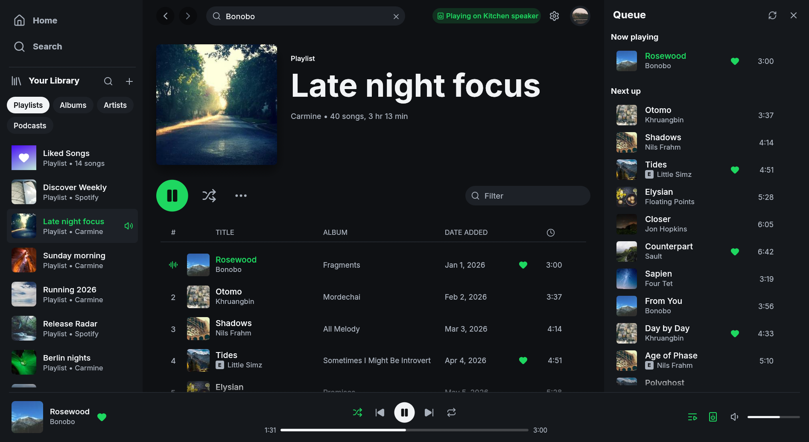

# Fastsonic

> [!NOTE] 
> **tl;dr:** fork of [Fastpotify](https://github.com/crmne/fastpotify) modified for self-hosted music servers. Should work with Subsonic/OpenSubsonic to Navidrome, Gonic, and compatible servers.



Tested with Navidrome and MacOS. It has no browser engine, telemetry, hosted backend - it's a thin client which streams the original audio file, and decodes it locally.

This fork will backport changes from `fastpotify` repository while removing Spotify-specific functionalities. Grab the newest binary from the [releases section](https://github.com/rwojsznis/fastsonic/releases). MacOS binaries are not signed so you have to explicitly allow application to open via system settings → security section.

## Features

- Songs, albums, artists, starred music, playlists, search, and a self-hosted
  library-focused Home page.
- A Library sidebar of Liked Songs, playlists, starred albums and artists to
  filter, pin, and drag into a custom order, or sort by name, creator, recent
  plays, or star date where the server records it; each section remembers its
  order.
- In-process playback of the formats in your library, including FLAC, MP3,
  AAC/ALAC, Vorbis, Opus, WAV, and AIFF; gapless transitions and byte-range
  seeking.
- Radio pages for a song, album, artist or playlist: the songs your server
  picks to go with it, which it finds through Last.fm or another agent.
  **Play** plays the songs on the page, **Refresh** asks for a new mix, and
  **Save as playlist** keeps it. Without an agent the page says so.
- An engine-owned queue that links back to its playing context, with
  drag-to-reorder and drop-in songs under Playing next, shuffle and
  repeat, ReplayGain normalisation, a ten-band equalizer, and a bounded
  on-disk audio cache.
- Restores the last track, position, context, and manually queued songs.
- Light, dark, and system themes, following the system by default, with
  optional album-art colour that fades between songs. On Linux, the system
  theme follows the desktop portal.
- [Custom themes](docs/_reference/settings-and-files.md#custom-themes): JSON
  colour palettes in a `themes` folder, picked in Settings after the built-in
  themes and applied at once. Eight (Catppuccin, Nord, Rose Pine, Tokyo Night
  and others) are put there on first start, as files to use, change or delete.
- System font fallbacks for titles in scripts Inter does not cover, and for
  the styled, circled and Javanese letters people put in names; Arabic is
  enlarged to read as large as the Latin text around it, and Windows prefers
  its interface fonts for Arabic, Hebrew, Thai, and Indic scripts.
- A player-bar spectrum or waveform that follows post-EQ sound and stays
  lively at zero volume, off by default. Click empty bar space to cycle modes.
- A Winamp mini player for classic `.wsz` skins, spectrum analyser,
  oscilloscope, equalizer, and playlist; on Windows and X11 it can leave the
  taskbar.
- A projectM-powered MilkDrop window with optional preset packs.
- Native window behaviour: on macOS, double-clicking the top bar does what
  Desktop & Dock asks (Fill, Zoom, Minimize or nothing); on Windows, the
  standard title bar, or Fastsonic's own if you choose it.
- Background playback, Linux MPRIS, desktop media controls, keyboard
  shortcuts, tray/Dock reopening, a Play/Pause, Next and Previous Dock menu
  on macOS, the same three buttons under the taskbar preview on Windows,
  and single-instance behavior.
- Smooth local Play and Pause transitions, plus searchable playlist choices
  when adding one song or a selection.
- Middle-click autoscroll: middle-click a list and move the pointer to scroll
  it; click, press Esc, turn the wheel or switch windows to stop. It works
  automatically on Windows. On Linux, turn on **Middle-click autoscroll**
  under **Settings > Appearance**; it is off by default because a middle
  click usually pastes there. See
  [autoscroll](docs/_guide/using-fastsonic.md#middle-click-autoscroll).
- Synced lyrics in a side panel or full-screen view, with line seeking and
  automatic following. Full screen places a large cover beside the lyrics in
  wide windows, or centres it when there are no words.

Fastsonic plays only on single computer. It does not provide Spotify Connect,
Subsonic jukebox mode, podcasts, offline sync, multiple server profiles, or a
second source of audio.

## Development

The repository includes a deterministic demo mode:

```sh
cargo run --features demo -- --demo --demo-page playlist:pl1 --demo-show queue
```

The tests that talk to a real server are `#[ignore]`d and need a Navidrome
of your own; `FASTSONIC_TEST_SERVER`, `FASTSONIC_TEST_USER` and
`FASTSONIC_TEST_PASSWORD` point them at it. Read
[CONTRIBUTING.md](CONTRIBUTING.md) before making changes; it defines the
required checks. The architecture is centered on:

- `src/api/subsonic/` — Subsonic transport, conversion, scrobbling, and the
  isolated Navidrome-native calls.
- `src/engine/` — streaming, block cache, decoding, playback chain, and queue.
- `src/backend.rs` — the runtime and channels used by the interface.
- `src/app.rs` and `src/ui/` — application state, navigation, and views.

## Acknowledgements

Fastsonic was forked from
[Fastpotify](https://github.com/crmne/fastpotify). It uses
[egui](https://github.com/emilk/egui), the [Inter](https://rsms.me/inter/)
typeface, [Lucide](https://lucide.dev) icons, and
[projectM](https://github.com/projectM-visualizer/projectm).

Licensed under the [MIT License](LICENSE).
